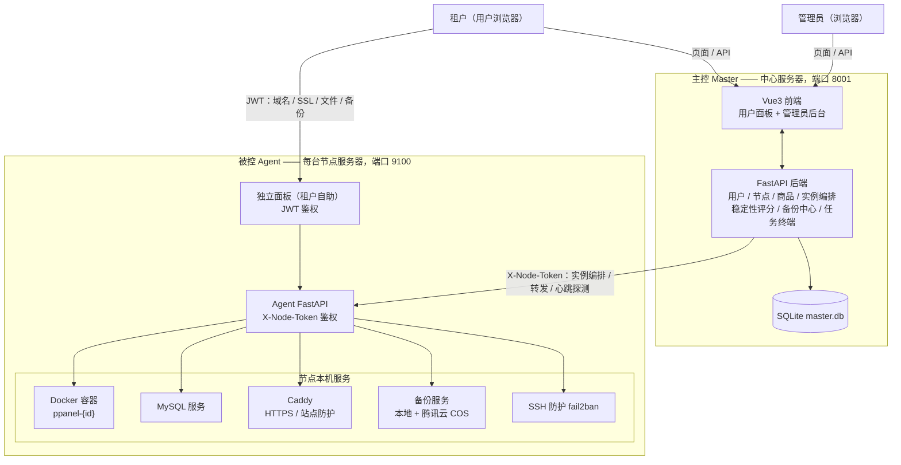

# PPanel

多租户售卖型云面板：一台中心服务器（主控）+ N 台节点服务器（被控），面向个人开发者开通、售卖和管理容器化建站实例。租户拿到实例后拥有一个功能完整的「独立面板」，可自助管理域名、SSL、数据库、文件与备份。

## 核心特性

**商城与实例**

- 商品管理 + 商城对接（webhook 自动开通），四维规格：CPU / 内存 / 月流量 / 有效期
- 多运行时实例：PHP / Node / Python / Go，开箱即用（示例入口文件 + 默认启动命令）
- 按实例的流量计量（Docker 网络增量采样、自然月重置、超 85% 告警）
- 容器 `unless-stopped` 自愈：进程崩溃 / OOM / 宿主机重启后秒级自动拉起

**独立面板（租户自助）**

- 域名绑定 + SSL：Caddy 自动申请 / 续期 Let's Encrypt 证书
- 数据库：MySQL 开通、phpMyAdmin 临时容器（2 小时自动回收）
- 文件管理：在线编辑 / 预览 / 右键操作
- 网站防护：密码保护（basic_auth）、IP 黑白名单、静态站点托管
- 备份：整库 / 表级备份（.sql.gz）、容器目录备份（.tar.gz）、定时任务、下载 / 恢复
- 依赖管理：npm / pnpm（Node）、go mod tidy + GOPROXY 加速（Go）

**管理员后台**

- 节点管理：Docker 概况、实例清单、SSH 防护（fail2ban）、稳定性评分
- 备份中心：不进节点即可备份 / 恢复任意节点数据，支持本地 + 腾讯云 COS 双目的地
- 实例管理：删除、归属节点、搜索、稳定运行时长（停止归零）
- 任务终端：耗时操作（备份 / 恢复 / Docker / 开通实例）实时日志滚动反馈

**稳定性评分**：心跳采集（60s）+ 实例事件记账，四维加权 —— 崩溃率 40% / 在线率 25% / 资源水位 20% / 服务异常 15%，输出分数与等级徽标。

## 架构



- **主控与被控**之间通过 HTTP + `X-Node-Token` 通信：主控下发实例编排、转发 Docker / WebSocket / 宿主机操作，并每 60 秒心跳探测用于稳定性评分。
- **租户与独立面板**之间使用 JWT（`Authorization: Bearer` 或 `?t=` 传参），到期后自动降级为只读模式。
- **宿主机管理 API**（备份、SSH 防护）支持 `X-Node-Token` / `X-API-Key` 双凭证鉴权。

## 术语约定

| 术语 | 含义 |
| --- | --- |
| 主控 | 中心端整体（管理员面板 + 用户面板），Windows 开发环境跑 8001 |
| 被控 | `installer/install.sh` 安装的 Agent（9100 端口），管理单台服务器 |
| 独立面板 | 被控上租户使用的自助界面（域名 / SSL / 数据库 / 文件 / 备份） |
| 节点面板 | 管理员在主控里打开的节点管理弹窗（Docker / SSH 防护等） |

## 目录结构

```
ppanel/
├── master/                    # 主控（中心端）
│   ├── backend/               # FastAPI + SQLAlchemy（SQLite）
│   │   └── app/
│   │       ├── routers/       # 转发层：docker_proxy / host_proxy / ws_proxy / instances ...
│   │       ├── stability.py   # 节点稳定性评分引擎
│   │       └── ...
│   └── frontend/              # Vue3 + Vite + Pinia（自研 UI 组件库）
├── agent/                     # 被控（部署在每台节点服务器）
│   ├── backend/
│   │   ├── app/
│   │   │   ├── routers/       # instances / files / backup / security / panel_ops ...
│   │   │   ├── services/      # instance_service / caddy / mysql / cron / cos / pma ...
│   │   │   └── panel_ui/      # 独立面板（租户自助单页应用）
│   │   ├── scripts/           # agent-wait / restart-agent / dbcheck
│   │   └── tests/
├── installer/
│   └── install.sh             # 总安装器（菜单/子命令：主控 Docker、被控、升级、重置、状态）
├── examples/                  # 示例
└── docs/                      # 文档
```

## 技术栈

| 层 | 技术 |
| --- | --- |
| 主控 / 被控后端 | Python 3.10+ · FastAPI · SQLAlchemy · SQLite · Docker SDK |
| 主控前端 | Vue 3 · Vite · Pinia · Vue Router · Monaco Editor（自研 UI 组件，未用 Element 等组件库） |
| 独立面板 | 原生单页 HTML（FastAPI 直接托管） |
| 节点服务 | Docker · Caddy（自动 HTTPS）· MySQL · fail2ban · 腾讯云 COS |
| 包管理 | 后端 uv，前端 npm |

## 快速开始

**一键安装（Linux 服务器，root）**

```bash
bash <(curl -fsSL https://cdn.jsdelivr.net/gh/2362400196/ppanel@master/installer/install.sh)
```

海外节点（jsDelivr 不可达时）直连 GitHub：

```bash
bash <(curl -fsSL https://raw.githubusercontent.com/2362400196/ppanel/master/installer/install.sh)
```

菜单选 `[1]` 安装主控（本机直装或 Docker；Docker 模式自动拉取预构建镜像，免本地编译）、`[2]` 安装被控（自动装 Docker / Caddy，注册 9100 端口 systemd 服务）。装完在被控输出里拿到 `NODE_TOKEN`，到主控「节点管理 → 接入节点」填入被控地址与 Token 即可接入。

**主控（开发机）**

```bash
cd master/backend
uv sync
uv run run.py            # 默认 http://127.0.0.1:8001

cd ../frontend
npm install
npm run build            # 构建后由后端托管；开发调试可用 npm run dev
```

随后在主控「节点管理 → 接入节点」填入被控地址与 Token（与被控 `.env` 中 `NODE_TOKEN` 一致）即可接入。

## 安全红线

- 被控默认只监听本机，需要对外时自行改 `0.0.0.0` 并确保 `NODE_TOKEN` 为强随机值
- 主控与被控通信地址使用 `127.0.0.1` 而非 `localhost`（避免 IPv6 解析超时）
- 租户备份严格按实例前缀过滤（`ppanel-1_` / `ppanel_1_`），杜绝越权访问；整包备份（.tar）仅管理员可用
- 备份文件名白名单校验，防路径穿越；表级备份只能操作实例登记库内的表
